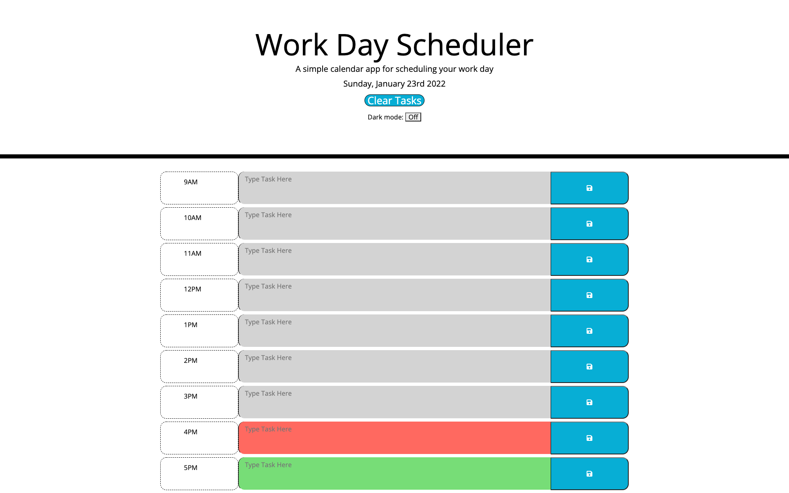

## JS WORK DAY PLANNER

### About
This is a simple 9-5 work day planner built using JS, HTML, and CSS. I also utilized Jquery, Bootstrap, Jquery UI, and Moment.js. 
The app dynamically styles each hour row based on the current time, past hours are grey, current hour is red, and future hours are green. 
The user can add tasks to any hour, and then save the data to local storage, so that the data will persist through a page reload.

### Extra Features

After finishing the base project, I decided to add a couple extra features! These include a clear button, which on click will clear localstorage and reset all input fields. I also added a JQuery UI modal/dialog that pops up whenever user clicks save, that will confirm they have saved their data to localstorage, as well as a light/dark mode toggle button.

Here is a link to my deployed site on [Github Pages](https://stone-com.github.io/JS-Work-Day-Planner/).

### Screenshot of Deployed App

